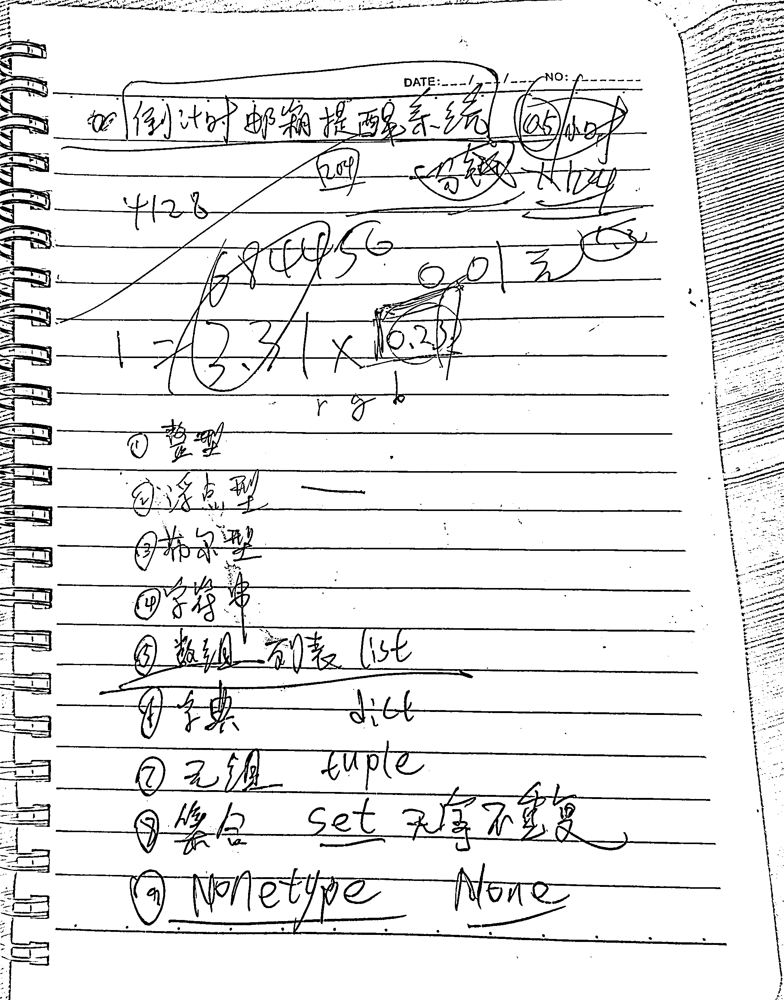

# 拍照文档转扫描版图片工具

通过接口调用方式将图片转成扫描版图片

## 源码参考

- https://github.com/endalk200/document-scanner

## 安装说明

1. 确保已安装Python 3.8
2. 安装依赖包：

```bash
pip install -r requirements.txt
```

## 运行应用

```bash
python app.py
```

## 接口

`POST` http://localhost:5000/scan_document

参数

        file: 要扫描的图像文件。
        correct_perspective: 如果为 True (默认值)，则图像将被校正透视以模拟俯视图。
                             如果为 False，则将保留原始图像布局。

## 截图展示

| 原图           | correct_perspective=true | correct_perspective=false |
|--------------|--------------------------|---------------------------|
|  |             |              |


